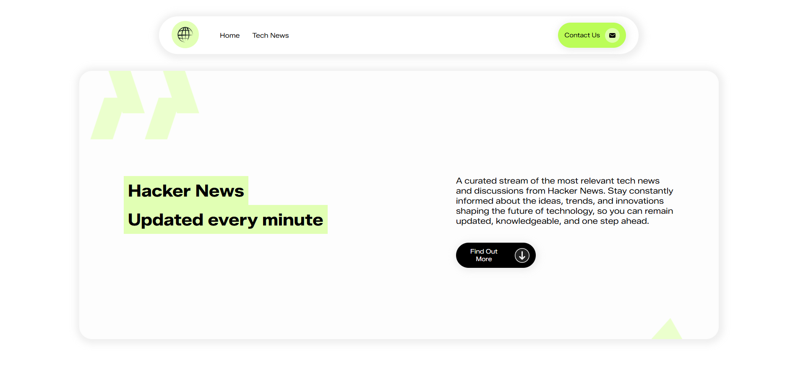
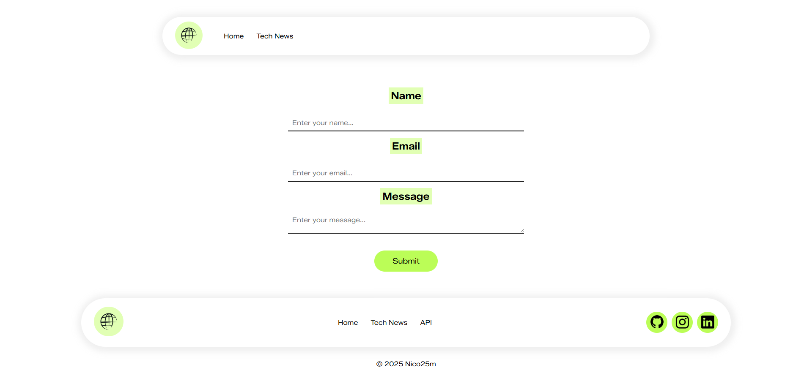

# HackerNews

This project aims to display tech news from Hacker News using data fetched from the Hacker News API.

## Screenshot


 

## Key Features & Benefits

- **Fetching News:** Retrieves new stories IDs from the Hacker News API.
- **Detailed News Display:** Fetches and displays detailed information for each news item, including title, URL, author, and score.
- **Dynamic Content:** Updates news items dynamically.
- **User-Friendly Interface:** Provides an intuitive and visually appealing way to browse Hacker News stories.
- **Contact Us Page:**  A dedicated page for users to reach out with inquiries or feedback.

## Prerequisites & Dependencies

-   Web browser (Chrome, Firefox, Safari, etc.)
-   Text editor or IDE (VSCode, Sublime Text, etc.)
-   Basic understanding of HTML, CSS, and JavaScript
-   No server-side technologies are required as this is a frontend project, but a basic understanding of how APIs work is beneficial.

## Installation & Setup Instructions

1.  **Clone the repository:** 
 
    ```bash
    git clone https://github.com/nico25m/HackerNews.git
    cd HackerNews
    ```

2.  **Open `index.html` in your browser:**

    -   The project is designed to run directly in the browser without needing a server.  Simply navigate to the root directory of the cloned repository and open the `index.html` file.

3.  **For Contact Us functionality:**

    - Navigate to the `assets/ContacUs/` directory and open `contacUs.html` in your browser.

## Usage Examples & API Documentation

The project uses the following Hacker News API endpoints:

-   **New Stories:** `https://hacker-news.firebaseio.com/v0/newstories.json` (fetches an array of story IDs)
-   **Item Details:** `https://hacker-news.firebaseio.com/v0/item/{id}.json` (fetches details for a specific story ID)

Here's an example of how data is fetched and displayed:

```javascript
async function newsId() {
  try {
    const urlApi = await fetch(
      "https://hacker-news.firebaseio.com/v0/newstories.json"
    );
    if (!urlApi.ok) throw new Error("Errore nel recupero degli ID delle news");
    return await urlApi.json();
  } catch (e) {
    console.log("Errore:", e.message);
  }
}

async function dettagliNews(id) {
  try {
    const urlApi = await fetch(
      `https://hacker-news.firebaseio.com/v0/item/${id}.json`
    );
    if (!urlApi.ok) throw new Error(`Errore nel recupero dei dettagli della news con ID: ${id}`);
    return await urlApi.json();
  } catch (e) {
    console.log("Errore:", e.message);
  }
}
```

## Configuration Options

There are no configurable settings as of now. The project is designed to fetch data directly from the Hacker News API without requiring any API keys or special configurations.

## License Information

License not specified. All rights reserved by the owner.

## Acknowledgments

-   Hacker News API for providing the data.
-   [Zalando Sans SemiExpanded](https://fonts.google.com/) font from Google Fonts.

## Author 

Nicolò

📧 Email: nicomelzi05@gmail.com

🌐 GitHub: https://github.com/nico25m

💼 LinkedIn: https://linkedin.com/in/nicolò-melzi

🌐 Link al Progetto: https://nico25m.github.io/HackNews/

<!-- 🌐 Link al Progetto webhosted:  -->
